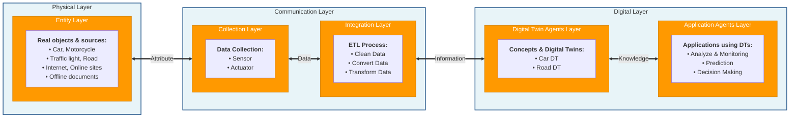

```mermaid


flowchart LR
    %% Physical Layer
    subgraph PhysicalLayer ["Physical Layer"]
        subgraph EntityLayer ["Entity Layer"]
            E1["<b>Real objects & sources:</b><br/>• Car, Motorcycle<br/>• Traffic light, Road<br/>• Internet, Online sites<br/>• Offline documents"]
        end
    end

    %% Communication Layer
    subgraph CommunicationLayer ["Communication Layer"]
        subgraph CollectionLayer ["Collection Layer"]
            C1["<b>Data Collection:</b><br/>• Sensor<br/>• Actuator"]
        end
        
        subgraph IntegrationLayer ["Integration Layer"]
            I1["<b>ETL Process:</b><br/>• Clean Data<br/>• Convert Data<br/>• Transform Data"]
        end
    end

    %% Digital Layer
    subgraph DigitalLayer ["Digital Layer"]
        subgraph DTAgentsLayer ["Digital Twin Agents Layer"]
            D1["<b>Concepts & Digital Twins:</b><br/>• Car DT<br/>• Road DT"]
        end

        subgraph AppAgentsLayer ["Application Agents Layer"]
            A1["<b>Applications using DTs:</b><br/>• Analyze & Monitoring<br/>• Prediction<br/>• Decision Making"]
        end
    end

    %% Flow connections with attributes/data/information/knowledge
    EntityLayer <== " Attribute " ==> CollectionLayer
    CollectionLayer <== " Data " ==> IntegrationLayer
    IntegrationLayer <== " Information " ==> DTAgentsLayer
    DTAgentsLayer <== " Knowledge " ==> AppAgentsLayer

    %% Styling
    style PhysicalLayer fill:#e8f4f8,stroke:#2b5c8f,stroke-width:2px
    style CommunicationLayer fill:#e8f4f8,stroke:#2b5c8f,stroke-width:2px
    style DigitalLayer fill:#e8f4f8,stroke:#2b5c8f,stroke-width:2px
    
    style EntityLayer fill:#ff9900,color:#fff,stroke:#cc7a00
    style CollectionLayer fill:#ff9900,color:#fff,stroke:#cc7a00
    style IntegrationLayer fill:#ff9900,color:#fff,stroke:#cc7a00
    style DTAgentsLayer fill:#ff9900,color:#fff,stroke:#cc7a00
    style AppAgentsLayer fill:#ff9900,color:#fff,stroke:#cc7a00

```